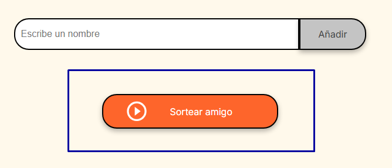
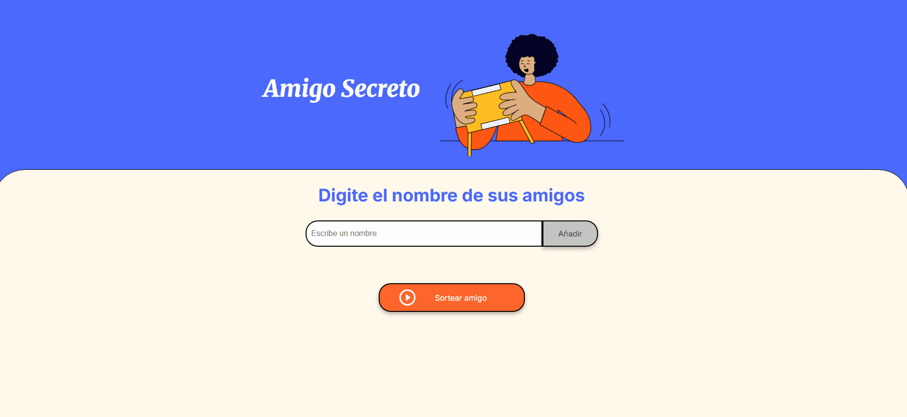

# 🎁 Amigo Secreto

¡Bienvenido a **Amigo Secreto**!  
Una aplicación desarrollada con el fin de organizar sorteos de amigos secretos de forma justa, rápida y aleatoria.

---

## 🛠️ Instalación

1. Cloná el repositorio:

```bash
`git clone https://github.com/Agustinnhzk/challenge-amigoSecreto.git `
```
Abrí index.html en tu navegador.

¡Listo! Ya podés empezar a agregar nombres y hacer sorteos.

💻 Cómo usar:

Escribí el nombre de cada participante en el campo de texto.

Presioná Añadir    para agregarlos a la lista.

Cuando todos estén agregados, presioná Sortear amigo 🎲  .

Mirá el resultado en pantalla y disfrutá de la sorpresa.




🔹Añadir múltiples participantes fácilmente.

🔹Sortear de forma aleatoria y justa.

🔹Interfaz sencilla y amigable.

🔹Funciona offline (descargando el proyecto).

🔹Compatible con todos los navegadores modernos.


👤 Autor

  


Agustín Negri Hrytezuk

[GitHub](https://github.com/Agustinnhzk)  | [LinkedIn](https://www.linkedin.com/in/agustín-negri-55b0a4281) 


